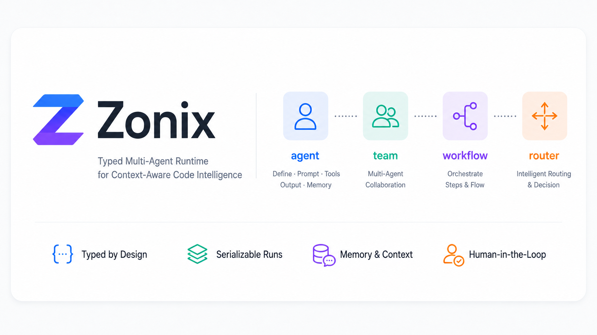

# Zonix



Zonix is a Python AI workflow framework with explicit agents and a serializable
run engine. It borrows the clarity of pydantic-ai's `Agent`, then adds first
class `workflow`, `team`, and `router` primitives on top of one execution model.

The core idea:

```python
plan = await planner("add captcha to the login page", ctx=ctx)
result = await planner.run("add captcha to the login page", ctx=ctx)

async for event in planner.stream("add captcha to the login page", ctx=ctx):
    print(event)
```

`__call__` returns the structured output. `.run()` returns the full trace, usage,
messages, and checkpoint metadata. `.stream()` returns typed events that can be
mapped to frontend protocols such as the Vercel AI SDK data stream.

## Install

```bash
pip install zonix
```

For local development from this repository:

```bash
pip install -e .
```

Optional model providers:

```bash
pip install "zonix[openai]"
pip install "zonix[anthropic]"
```

## Single agent

```python
from pydantic import BaseModel

from zonix import agent
from zonix.models import OpenAI


class Plan(BaseModel):
    goal: str
    files: list[str]
    steps: list[str]


planner = (
    agent(
        "planner",
        role="Plan code work",
        model=OpenAI("gpt-5.2", temperature=0.2),
        output=Plan,
    )
    .use(read_tree, search_code)
    .prompt(
        "Split the user request into a code plan. "
        "Return only JSON that matches the Plan schema."
    )
)

plan = await planner("add captcha to the login page", ctx=project_ctx)
```

An agent definition keeps the important pieces in one place:

- `name` and `role` for trace readability.
- `model` as a typed object, not a provider string.
- `output` as a Pydantic model or Python type.
- `deps` through `ctx`.
- tools via `.use(...)` or `@agent.tool`.
- static or dynamic prompts via `.prompt(...)`.

## Tools

Tool schemas are generated from type hints and docstrings.

```python
coder = agent("coder", output=Patch, deps=ProjectCtx).use(read_file)


@coder.tool(approval=True)
async def write_file(ctx, path: str, content: str) -> bool:
    """Write content to a repository file."""
    return ctx.deps.repo.write(path, content)
```

If a tool takes `ctx` as its first parameter, Zonix passes a `ToolContext` with
`deps`, shared usage, the current run state, and the owning agent.

## Three call levels

```python
output = await planner(task, ctx=ctx)
run = await planner.run(task, ctx=ctx)

async for event in planner.stream(task, ctx=ctx):
    ...
```

All three calls use the same run engine. The engine owns prompt assembly, model
calls, tool execution, output validation, usage aggregation, spans, checkpoints,
and event emission.

## Workflow

```python
from zonix import workflow

code_flow = (
    workflow("code_team")
    .start(planner)
    .then(coder)
    .then(reviewer)
    .build()
)

review = await code_flow.solve("add captcha to login", ctx=ctx)
```

`workflow` compiles ordered steps into a node. The output of one node becomes
the input of the next node, while `ctx`, usage, trace, scratch, and stream events
are automatically carried through the run.

The builder also supports `parallel`, `join`, `branch`, and `loop`:

```python
flow = (
    workflow("review")
    .start(planner)
    .parallel(security_review, perf_review)
    .join(merge_reviews)
    .branch(lambda review: review.risk == "high", then=human_gate, else_=auto_apply)
    .loop(coder, until=lambda patch: patch.tests_pass, max_iters=3)
    .build()
)
```

## Team and router

```python
from zonix import router, team
from zonix.types import Route


def choose(task, state) -> Route:
    if "review" in str(task).lower():
        return Route(next="reviewer")
    return Route(next="coder")


code_team = (
    team("code_team")
    .add(planner, coder, reviewer)
    .route(router("rule_router", choose))
    .build(max_steps=6)
)

answer = await code_team.solve("review the auth changes", ctx=ctx)
```

A router can be a rule function, another agent, or any node that returns
`Route(next=..., done=..., input=...)`.

## Memory

```python
from zonix.memory import Session, Summarize, Vector, Window

session = Session(memory=[Window(size=20), Vector(store=my_store)])
assistant = agent("assistant", memory=[Summarize(over=170_000, keep=20)])

answer = await assistant("continue from last time", ctx=ctx, session=session)
```

Memory strategies are typed and composable. They transform prior session history
before the current run is assembled.

## Streaming events

Zonix streams typed Python events:

- `TextStart`, `TextDelta`, `TextEnd`
- `ReasoningDelta`
- `ToolInputStart`, `ToolInputDelta`, `ToolInputAvailable`
- `ToolOutputAvailable`
- `ApprovalRequired`
- `ErrorEvent`, `Finish`

Frontend protocols are adapters. For Vercel AI SDK data streams:

```python
from zonix.wire.ai_sdk import to_ai_sdk

async for chunk in to_ai_sdk(agent.stream(task, ctx=ctx)):
    yield chunk
```

HTTP responses should include:

```text
x-vercel-ai-ui-message-stream: v1
content-type: text/event-stream
```

## Human approval and resume

Tools can pause the run before execution:

```python
run = await coder.run("edit the login page", ctx=ctx)

if run.paused:
    print(run.pending)
    run = await run.resume(approve=True)
```

`run.dump()` returns a JSON-safe snapshot with output, usage, trace, messages,
scratch, and pending approval metadata. `CheckpointStore` can persist snapshots
to disk.

## Architecture

```text
zonix/
  spec.py       agent()/team()/workflow()/router() factories
  engine.py     serializable Run engine and Agent execution
  runtime.py    __call__/run/stream driver shared by every node
  memory/       Window, Summarize, Vector, Session
  multi/        Workflow, Team, Router nodes
  hitl.py       checkpoint save/load and approval keys
  models/       complete/stream model adapters
  wire/         event-to-wire protocol adapters
  obs.py        lightweight observability hooks
```

Zonix is intentionally explicit: business code should say what it means, and
the run engine should make every step inspectable.
